# 📈 EquityInsight AI

### AI-Powered Quantitative Investment Research & Decision-Support Platform

> **EquityInsight AI is an interactive financial analytics platform that combines technical analysis, fundamental analysis, market data, news sentiment, risk modelling, portfolio analytics, Monte Carlo simulation, and AI-assisted investment insights into a single Streamlit application.**

---

## 🌟 Overview

**EquityInsight AI** is a Python-based investment research and financial analytics platform designed to help users evaluate stocks using multiple analytical perspectives.

Instead of relying on a single indicator, the platform combines:

* 📈 Technical analysis
* 💰 Fundamental analysis
* 📰 Financial news sentiment
* 🤖 AI-assisted insights
* ⚖️ Risk assessment
* 🎯 Investment scoring
* 🏛️ AI Investment Committee
* 🎲 Monte Carlo simulation
* 💼 Portfolio construction
* ⚖️ Multi-stock comparison
* 📊 Market monitoring
* 📄 Automated investment reports

The application provides an interactive interface through **Streamlit**, allowing users to enter a stock ticker and explore different layers of financial analysis.

---

# 🎯 Project Objectives

The main objectives of EquityInsight AI are to:

1. Combine multiple financial analysis techniques into one platform.
2. Provide quantitative stock scoring and risk assessment.
3. Explain investment decisions rather than only providing a Buy/Hold/Sell label.
4. Provide AI-assisted investment research and scenario analysis.
5. Help users compare multiple stocks.
6. Provide portfolio construction and portfolio analytics.
7. Simulate potential future price outcomes using Monte Carlo methods.
8. Generate downloadable investment research reports.

> ⚠️ **EquityInsight AI is an educational and research tool. It does not provide financial advice or guarantee investment returns.**

---

# ✨ Core Features

## 📈 1. Stock Analysis

The Stock Analysis module allows users to enter an individual stock ticker and perform a detailed analysis.

The analysis includes:

* Current stock information
* Company information
* Technical indicators
* Technical scoring
* Volatility analysis
* Trend analysis
* News sentiment
* Support and resistance levels
* Chart pattern detection
* Investment recommendation
* Risk classification
* Confidence score
* AI investment thesis
* Investment strengths and weaknesses
* AI investment committee
* Scenario simulation
* AI mentor
* AI assistant
* Investment checklist

---

# 📊 2. Technical Analysis

EquityInsight AI calculates technical indicators from historical market data.

Current technical-analysis components include:

* Moving averages
* RSI
* MACD
* Volatility
* Trend analysis
* Technical signal analysis
* Support and resistance
* Candlestick/chart pattern detection

Technical analysis is used as one of the inputs to the platform's overall stock scoring system.

---

# 💰 3. Fundamental Analysis

The platform retrieves company and financial information and presents fundamental metrics such as:

* Market capitalization
* P/E ratio
* EPS
* ROE
* Debt-to-equity
* Dividend-related information
* Company profile
* Financial statements

Financial statements include:

* Income Statement
* Balance Sheet
* Cash Flow Statement

---

# 📰 4. News & Sentiment Analysis

The platform retrieves financial news and performs sentiment analysis.

The sentiment pipeline includes:

```text
Financial News
      ↓
News Collection
      ↓
Sentiment Analysis
      ↓
Positive / Neutral / Negative
      ↓
Overall News Sentiment
      ↓
Investment Scoring
```

This allows current news sentiment to contribute to the overall investment analysis.

---

# 🎯 5. Investment Scoring

The project contains a dedicated scoring module that combines analytical signals into investment-related scores.

The scoring system includes:

* Technical score
* Final/adjusted score
* Risk classification
* Recommendation generation
* Trend analysis

The resulting analysis can produce recommendations such as:

* Buy
* Hold
* Sell

The score is also used by other modules such as confidence analysis and AI insights.

---

# 🤖 6. AI Investment Insights

The AI Insights section explains the results of the quantitative analysis.

It considers:

* Stock ticker
* Adjusted score
* Recommendation
* Risk
* Confidence
* Trend explanation
* Strengths
* Weaknesses

The objective is to make the numerical analysis easier to understand instead of simply displaying raw scores.

Example workflow:

```text
Quantitative Analysis
        ↓
Adjusted Score
        ↓
Recommendation
        ↓
Risk + Confidence
        ↓
Strengths / Weaknesses
        ↓
AI Investment Insights
```

---

# 🧠 7. AI Investment Thesis

The Investment Thesis module generates a structured explanation of the stock's investment case.

It considers information such as:

* Company information
* Price data
* Recommendation
* Risk
* News sentiment
* Fundamentals

The thesis provides a higher-level interpretation of the analysis.

---

# 🏛️ 8. AI Investment Committee

One of the major features of EquityInsight AI is its virtual investment committee.

The committee contains different analytical roles:

* 📈 Technical Analyst
* 💰 Fundamental Analyst
* 📰 News Analyst
* ⚠️ Risk Manager

Each role evaluates the stock from a different perspective.

The committee then produces:

* Individual analyst opinions
* Reasons supporting each opinion
* Final committee decision
* Committee confidence

This creates a multi-perspective decision-support framework.

---

# 🎲 9. Monte Carlo Simulation

The Monte Carlo module provides quantitative price simulations.

The simulation generates possible future price paths and calculates statistics such as:

* Expected price
* Probability of profit
* Best-case price
* Worst-case price
* Lower confidence interval
* Upper confidence interval

Conceptually:

```text
Historical Price Data
        ↓
Return / Volatility Estimation
        ↓
Monte Carlo Simulation
        ↓
Multiple Future Price Paths
        ↓
Statistical Analysis
```

This module is intended for risk exploration rather than guaranteed price prediction.

---

# 💼 10. AI Portfolio Builder

The Portfolio Builder allows users to select multiple stocks and specify:

* Investment amount
* Risk preference
* Portfolio stocks

The platform then generates a portfolio and provides:

* Suggested allocation
* Investment amount per stock
* Portfolio analytics
* Portfolio chart
* AI portfolio explanation

---

# 📐 11. Portfolio Optimization

The project also contains portfolio optimization functionality.

The portfolio optimizer includes functionality for:

* Portfolio statistics
* Random portfolio generation
* Efficient frontier visualization
* Identifying suitable portfolios

This provides a quantitative approach to portfolio construction.

---

# ⚖️ 12. Stock Comparison

The Stock Comparison module allows users to compare multiple stocks.

The comparison system can evaluate stocks using information such as:

* Scores
* Recommendations
* Risk
* Technical performance
* Fundamental information

It also generates an AI comparison verdict.

Workflow:

```text
Select Multiple Stocks
        ↓
Stock Analysis
        ↓
Comparison DataFrame
        ↓
Comparison Chart
        ↓
AI Comparison Verdict
```

---

# 📊 13. Market Watch

The Market Watch dashboard provides a broader market view.

It includes:

* Market overview
* Watchlist
* Stock prices
* Trend information
* Recommendations
* Top gainers
* Top losers

The Market Watch section is designed to provide a quick snapshot before performing detailed individual-stock analysis.

---

# 🚨 14. Alerts

The alerts module generates alerts based on stock analysis and support/resistance information.

This allows important analytical conditions to be surfaced to the user.

---

# 💬 15. AI Assistant

The AI Assistant allows users to ask questions about an analyzed stock.

The assistant receives relevant analytical information such as:

* Company information
* Recommendation
* Risk
* Confidence
* Fundamentals
* News sentiment
* Support/resistance
* Investment thesis

This allows users to interact with the analysis rather than only reading static results.

---

# 🎓 16. AI Investment Mentor

The Investment Mentor provides educational explanations based on the stock's:

* Recommendation
* Risk
* News sentiment
* Support/resistance
* Adjusted score

The purpose is to make financial analysis easier to understand.

---

# 📋 17. Investment Checklist

The AI Investment Checklist creates a structured checklist based on the analyzed stock.

It considers:

* Technical information
* Recommendation
* Risk
* News sentiment
* Fundamentals
* Support/resistance

---

# 🔮 18. Scenario Simulator

The Scenario Simulator allows users to explore hypothetical events such as:

* Stock falls 10%
* Positive earnings
* Negative earnings
* Interest rate hike
* Interest rate cut

The simulator evaluates the scenario using the current stock analysis.

---

# 📄 19. Automated PDF Investment Reports

EquityInsight AI can generate downloadable PDF investment reports.

The report system can include:

* Company information
* Investment recommendation
* Adjusted score
* Confidence
* Risk
* Investment thesis
* Fundamentals
* Technical reasons
* Strengths
* Weaknesses
* News sentiment
* AI committee decision
* Monte Carlo statistics
* Scenario results

This allows the analysis to be exported as a structured research document.

---

# 🖥️ Application Architecture

The application follows a modular architecture:

```text
                    ┌──────────────────────┐
                    │       app.py         │
                    │   Streamlit Entry    │
                    └──────────┬───────────┘
                               │
             ┌─────────────────┼─────────────────┐
             │                 │                 │
             ▼                 ▼                 ▼
      Stock Analysis      Market Watch      Portfolio
      analysis_ui.py      market_watch_ui   portfolio_ui.py
             │
             ▼
       Analysis Engine
             │
    ┌────────┼─────────┐
    │        │         │
    ▼        ▼         ▼
Technical Fundamental  News
Analysis   Analysis    Sentiment
    │        │         │
    └────────┼─────────┘
             ▼
          Scoring
             │
     ┌───────┼────────┐
     ▼       ▼        ▼
   Risk   Confidence Recommendation
     │       │        │
     └───────┼────────┘
             ▼
       AI Insights
             │
     ┌───────┼─────────────┐
     ▼       ▼             ▼
   Thesis  Committee     Assistant
             │
             ▼
        Final Decision
```

---

# 📂 Project Structure

The project is organized into several logical layers.

```text
EquityInsights/
│
├── app.py
│
├── ─────────────── UI / APPLICATION ───────────────
│
├── analysis_ui.py
├── market_watch_ui.py
├── portfolio_ui.py
├── comparison_ui.py
├── about_ui.py
│
├── ─────────────── DATA & MARKET DATA ───────────────
│
├── data.py
├── live_price.py
├── market.py
├── watchlist.py
├── timeframes.py
│
├── ─────────────── TECHNICAL ANALYSIS ───────────────
│
├── indicators.py
├── analysis.py
├── patterns.py
├── support_resistance.py
├── multi_timeframe.py
│
├── ─────────────── SCORING & DECISION ENGINE ───────────────
│
├── scoring.py
├── confidence.py
├── explainability.py
├── score_breakdown.py
├── pros_cons.py
├── opportunities.py
├── alerts.py
│
├── ─────────────── NEWS & SENTIMENT ───────────────
│
├── sentiment.py
├── news_chart.py
│
├── ─────────────── AI / DECISION SUPPORT ───────────────
│
├── assistant_ai.py
├── thesis.py
├── committee.py
├── mentor.py
├── checklist.py
├── scenario.py
├── screener.py
│
├── ─────────────── STOCK COMPARISON ───────────────
│
├── comparison.py
├── comparison_ui.py
│
├── ─────────────── PORTFOLIO ───────────────
│
├── portfolio.py
├── portfolio_ai.py
├── portfolio_optimizer.py
├── portfolio_ui.py
│
├── ─────────────── VISUALIZATION ───────────────
│
├── charts.py
├── dashboard.py
├── gauge.py
│
├── ─────────────── REPORTING ───────────────
│
├── report.py
├── pdf_report.py
├── financials.py
|
├── ─────────────── CONFIGURATION ───────────────
│
├── requirements.txt
├── .env
├── .gitignore
├── LICENSE
├── COPYRIGHT
├── README.md
│
├── ─────────────── DOCUMENTATION / IMAGES ───────────────
│
├── images/
│   ├── home.png
│   ├── analysis.png
│   ├── analysis2.png
│   ├── market_watch.png
│   ├── stock_comparison.png
│   ├── stock_comparison2.png
│   ├── stock_comparison3.png
│   ├── portfolio_builder.png
│   ├── monte_carlo.png
│   ├── monte_carlo_2.png
│   ├── investment report.png
│   ├── Ai_investmenst_thesis.png
│   ├── AI_investment_mentor.png
│   ├── ai_Assistant.png
│   ├── investment_committe_1.png
│   ├── investment_committe_2.png
│   ├── news sentiments.png
│   ├── income_statement.png
│   ├── balance_sheet.png
│   ├── cash_flow_statement.png
│   ├── strengths.png
│   ├── weaknesses.png
│   └── support and resistance.png
│
└── ─────────────── SAMPLE OUTPUTS ───────────────
│
├── AAPL_Investment_Report.pdf
└── RELIANCE.NS_Investment_Report.pdf
```

> `__pycache__/` is generated automatically by Python and should not be treated as part of the source-code architecture.

---

# 🧩 Module Reference

## Application & UI

| File                 | Responsibility                               |
| -------------------- | -------------------------------------------- |
| `app.py`             | Main Streamlit entry point and navigation    |
| `analysis_ui.py`     | Complete individual stock analysis interface |
| `market_watch_ui.py` | Market Watch interface                       |
| `portfolio_ui.py`    | Portfolio Builder interface                  |
| `comparison_ui.py`   | Multi-stock comparison interface             |
| `about_ui.py`        | About/project information interface          |

---

## Data & Market Modules

| File            | Responsibility                                                         |
| --------------- | ---------------------------------------------------------------------- |
| `data.py`       | Stock data, company information, fundamentals and financial statements |
| `live_price.py` | Live stock price retrieval                                             |
| `market.py`     | Market overview information                                            |
| `watchlist.py`  | Watchlist, gainers and losers                                          |
| `timeframes.py` | Timeframe and interval configuration                                   |
| `financials.py` | Financial statement retrieval/processing                               |

---

## Technical Analysis

| File                    | Responsibility                      |
| ----------------------- | ----------------------------------- |
| `indicators.py`         | Technical indicators and volatility |
| `analysis.py`           | Technical signal analysis           |
| `patterns.py`           | Pattern detection                   |
| `support_resistance.py` | Support/resistance calculation      |
| `multi_timeframe.py`    | Multi-timeframe analysis            |

---

## Scoring & Risk

| File                 | Responsibility                                               |
| -------------------- | ------------------------------------------------------------ |
| `scoring.py`         | Technical score, final score, recommendation, risk and trend |
| `confidence.py`      | Confidence calculation                                       |
| `score_breakdown.py` | Score explanation/breakdown                                  |
| `explainability.py`  | Decision explanation                                         |
| `pros_cons.py`       | Strength and weakness generation                             |
| `opportunities.py`   | Opportunities and risks                                      |
| `alerts.py`          | Analytical alerts                                            |

---

## AI & Decision Support

| File              | Responsibility                       |
| ----------------- | ------------------------------------ |
| `assistant_ai.py` | Interactive stock-analysis assistant |
| `thesis.py`       | AI investment thesis                 |
| `committee.py`    | Multi-member AI investment committee |
| `mentor.py`       | Investment mentor                    |
| `checklist.py`    | Investment checklist                 |
| `scenario.py`     | Scenario simulation                  |
| `screener.py`     | AI insight generation                |

---

## News & Sentiment

| File            | Responsibility                        |
| --------------- | ------------------------------------- |
| `sentiment.py`  | News retrieval and sentiment analysis |
| `news_chart.py` | Sentiment visualization               |

---

## Portfolio

| File                     | Responsibility                                                 |
| ------------------------ | -------------------------------------------------------------- |
| `portfolio.py`           | Portfolio generation and portfolio calculations                |
| `portfolio_ai.py`        | AI portfolio explanation                                       |
| `portfolio_optimizer.py` | Portfolio statistics, random portfolios and efficient frontier |
| `portfolio_ui.py`        | Portfolio Builder UI                                           |

---

## Comparison

| File               | Responsibility                                       |
| ------------------ | ---------------------------------------------------- |
| `comparison.py`    | Stock comparison calculations, charts and AI verdict |
| `comparison_ui.py` | Stock comparison interface                           |

---

## Visualization

| File           | Responsibility         |
| -------------- | ---------------------- |
| `charts.py`    | Dashboard charts       |
| `dashboard.py` | Technical dashboard    |
| `gauge.py`     | Investment score gauge |

---

## Reporting

| File            | Responsibility                                 |
| --------------- | ---------------------------------------------- |
| `report.py`     | Investment report display                      |
| `pdf_report.py` | PDF report generation                          |
| `financials.py` | Financial statement presentation/data handling |

---

# 🔄 End-to-End Data Flow

The main stock-analysis pipeline can be summarized as:

```text
User enters ticker
        │
        ▼
   data.py
        │
        ▼
Historical Stock Data
        │
        ├──────────────► Company Information
        │
        ├──────────────► Fundamentals
        │
        └──────────────► Financial Statements
        │
        ▼
 indicators.py
        │
        ▼
Technical Indicators
        │
        ├──────────────► analysis.py
        ├──────────────► patterns.py
        ├──────────────► support_resistance.py
        └──────────────► volatility
        │
        ▼
    scoring.py
        │
        ├──────────────► Technical Score
        ├──────────────► Risk
        ├──────────────► Trend
        └──────────────► Recommendation
        │
        ▼
    sentiment.py
        │
        ▼
    News Sentiment
        │
        ▼
    Final Score
        │
        ▼
 ┌──────┼──────────────┐
 │      │              │
 ▼      ▼              ▼
Risk  Confidence    Recommendation
 │      │              │
 └──────┼──────────────┘
        ▼
    AI Modules
        │
        ├── Investment Thesis
        ├── AI Committee
        ├── AI Insights
        ├── AI Mentor
        ├── AI Assistant
        ├── Checklist
        └── Scenario Simulator
        │
        ▼
   Final Analysis
        │
        ├──────────────► Streamlit Dashboard
        │
        └──────────────► PDF Investment Report
```

---

# 🖥️ Streamlit Navigation

The application provides the following main navigation sections:

```text
🏠 Home
│
├── 📊 Market Watch
│
├── 📈 Stock Analysis
│
├── 💼 Portfolio Builder
│
├── ⚖️ Compare Stocks
│
└── ℹ️ About
```

---

# 🛠️ Technology Stack

## Programming Language

* Python

## Application Framework

* Streamlit

## Data Processing

* Pandas
* NumPy

## Financial Data

* Yahoo Finance / `yfinance`
* Additional HTTP/API integrations through `requests`

## Visualization

* Plotly
* Matplotlib

## AI / NLP

* Transformers
* PyTorch
* GNews
* Custom AI/decision-support logic

## Machine Learning / Quantitative Tools

* Scikit-learn
* NumPy
* Monte Carlo simulation
* Portfolio optimization

## Report Generation

* ReportLab

---

# 📦 Installation

## 1. Clone the repository

```bash
git clone <YOUR_REPOSITORY_URL>
```

## 2. Enter the project directory

```bash
cd EquityInsights
```

## 3. Create a virtual environment

### Windows

```bash
python -m venv venv
venv\Scripts\activate
```

### macOS / Linux

```bash
python3 -m venv venv
source venv/bin/activate
```

## 4. Install dependencies

```bash
pip install -r requirements.txt
```

## 5. Configure environment variables

Create/configure your `.env` file with the API credentials required by the modules that use external services.

**Do not commit `.env` to GitHub.**

The project already contains a `.gitignore` file for repository hygiene.

## 6. Run the application

```bash
streamlit run app.py
```

The Streamlit application will then open in your browser.

---

# 📋 Requirements

The project currently declares the following packages in `requirements.txt`:

```text
streamlit
yfinance
pandas
numpy
plotly
matplotlib
transformers
torch
gnews
requests
scikit-learn
```

---

# 🖼️ Application Screenshots

The `images/` directory contains screenshots demonstrating the major features of the platform.

### Stock Analysis

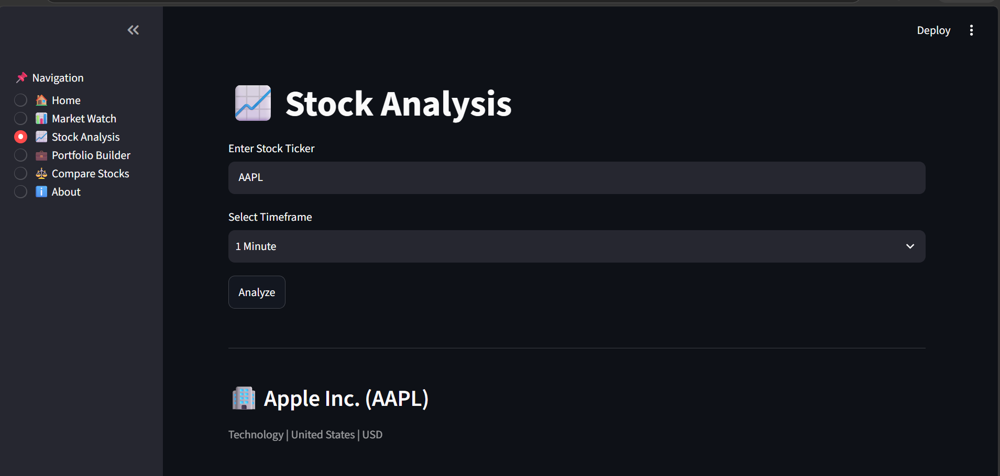

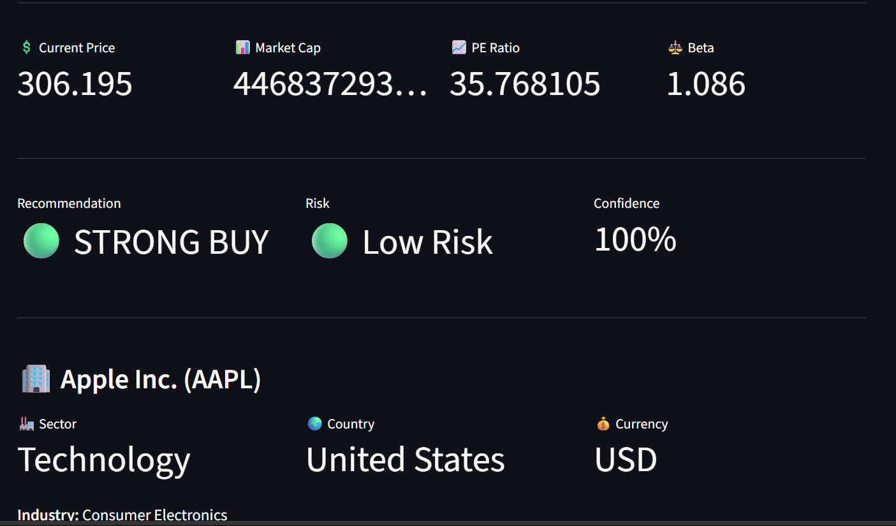

### AI Investment Thesis

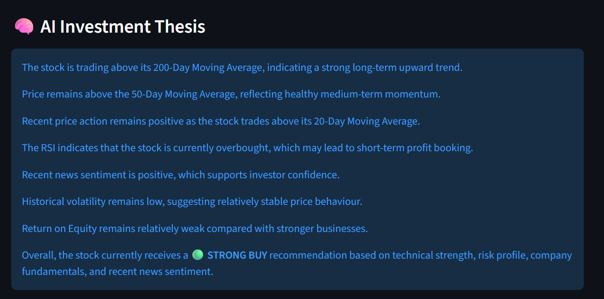

### AI Investment Committee

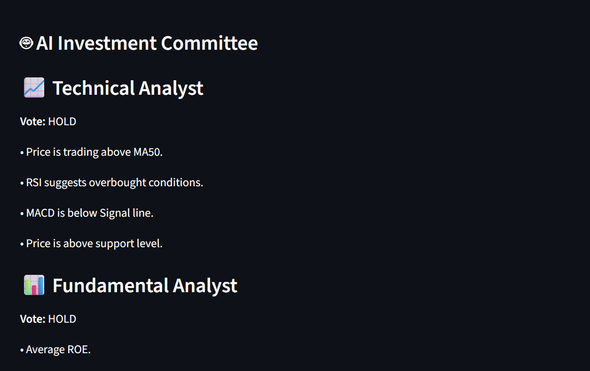

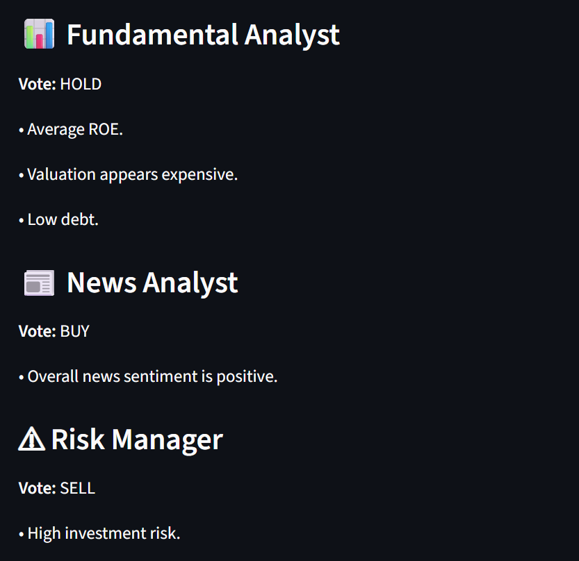

### AI Assistant

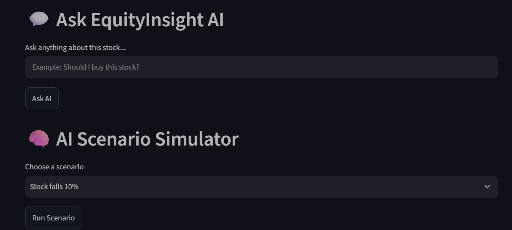

### AI Investment Mentor

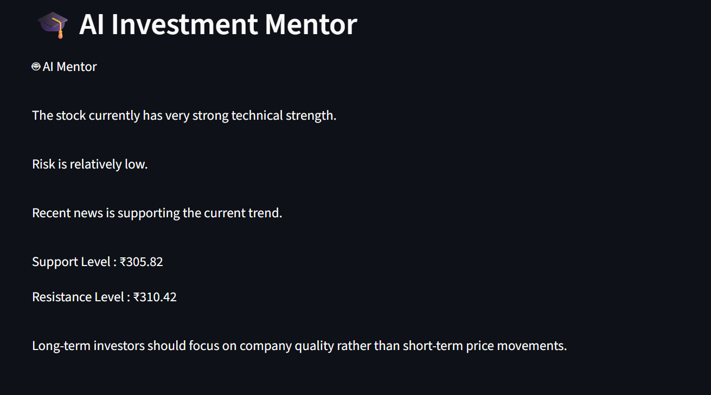

### Monte Carlo Simulation

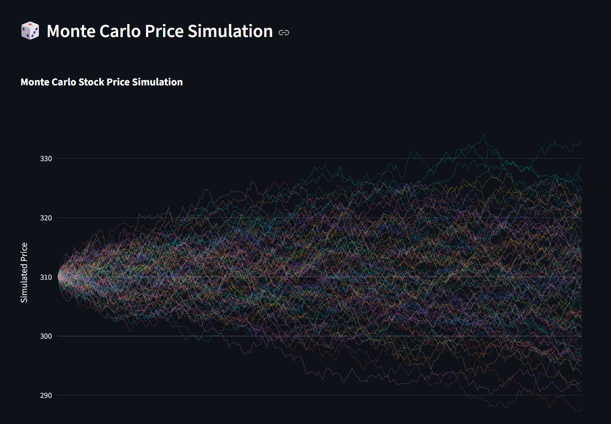

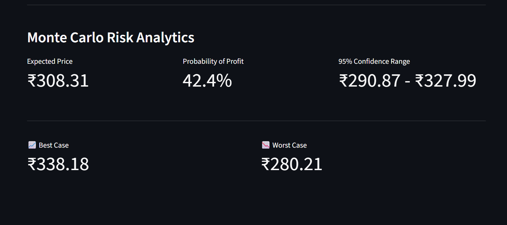

### Portfolio Builder

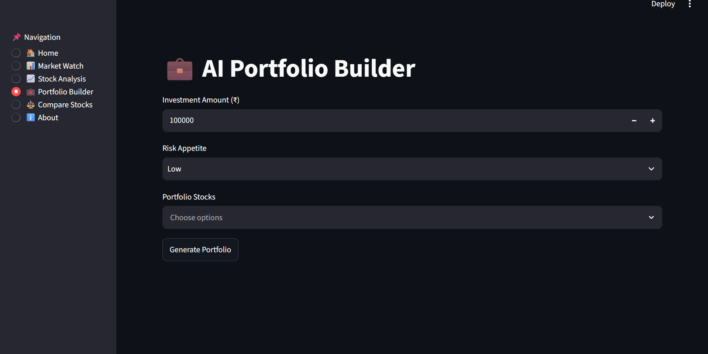

### Stock Comparison

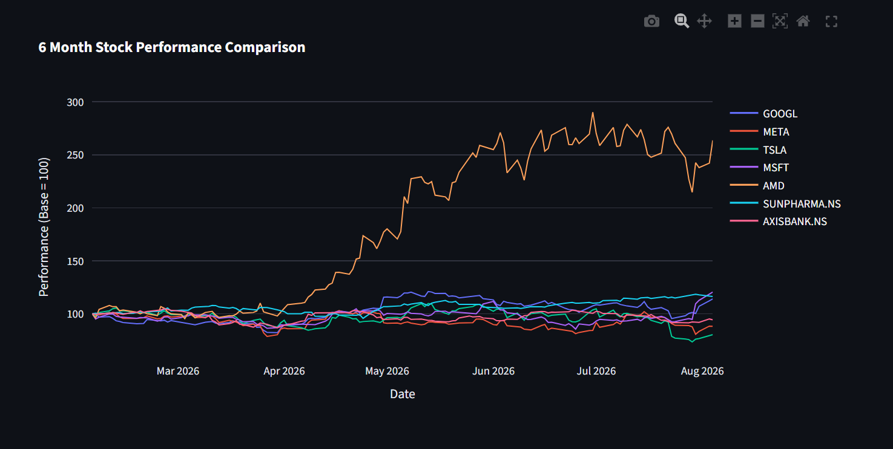

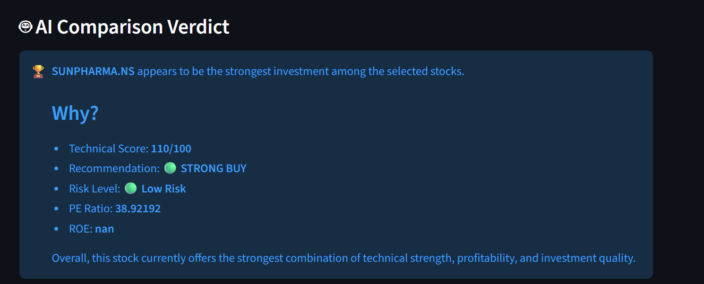

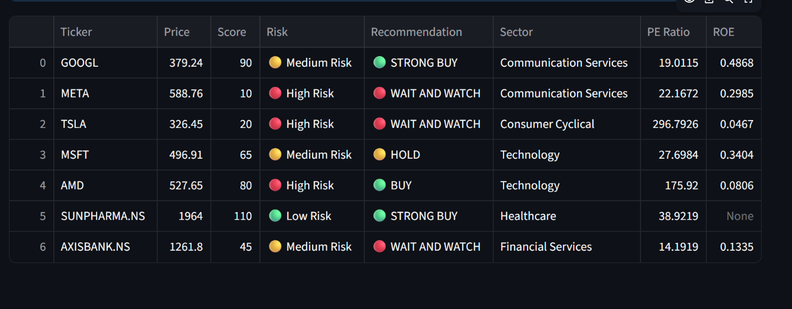

### Market Watch

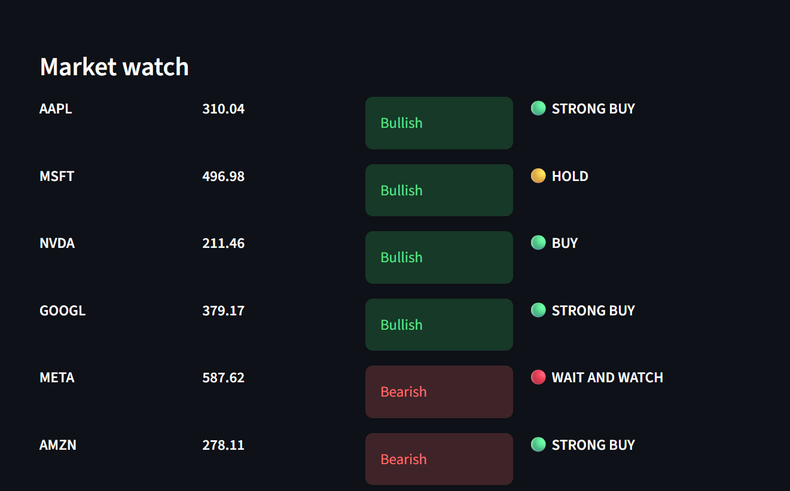

### Financial Statements

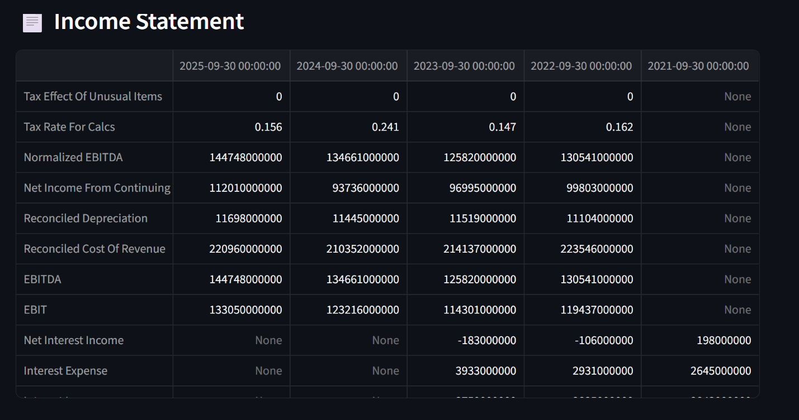

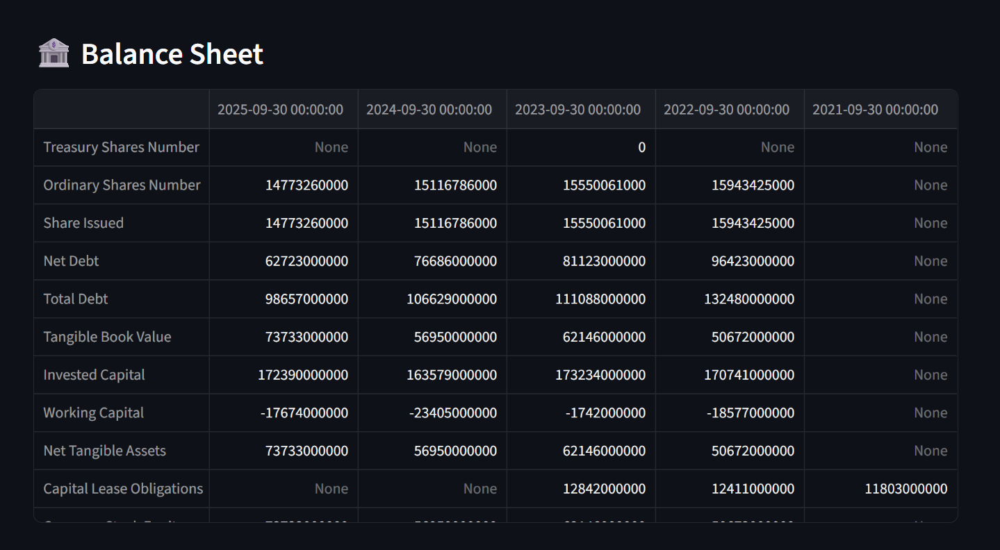

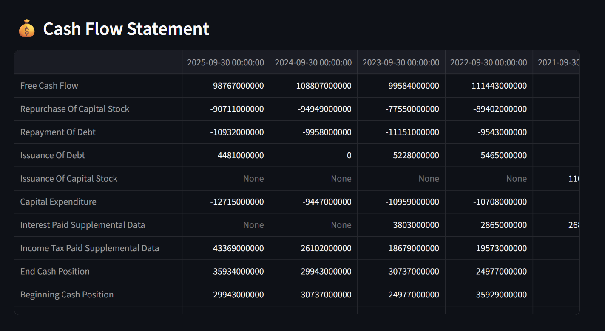

### Investment Report


---

# 📄 Sample Reports

The project includes sample generated investment reports:

* `AAPL_Investment_Report.pdf`
* `RELIANCE.NS_Investment_Report.pdf`

These demonstrate the PDF reporting functionality of the application.

---

---

# 🚀 Future Enhancements

Potential future improvements include:

### Quantitative Finance

* CAPM analysis
* Value at Risk (VaR)
* Sharpe ratio optimization
* Sortino ratio
* Maximum drawdown
* Beta-based portfolio modelling
* More advanced portfolio optimization

### Machine Learning

* LSTM-based price modelling
* Transformer-based financial NLP
* ML-based stock ranking
* Earnings prediction
* Anomaly detection

### AI

* Retrieval-augmented financial research
* Financial document Q&A
* More advanced AI investment explanations
* Personalized research summaries

### Platform

* User authentication
* Cloud deployment
* Database-backed watchlists
* Persistent portfolios
* Real-time alerts
* Scheduled reports
* Mobile-friendly interface

---

# ⚠️ Disclaimer

EquityInsight AI is intended for **educational, analytical, and research purposes only**.

The platform's scores, recommendations, simulations, AI-generated insights, and other outputs are not guarantees of future performance and should not be interpreted as professional financial advice.

Users should conduct their own research and consult a qualified financial professional before making investment decisions.

---
## Demonstration of the Project 
Video: https://youtu.be/apaPLQmZHDQ

## 👩‍💻 Developer

**Lakshmi**

BSC Applied Statistics and Data Science 
Symbiosis Statistical Institute

Ba Economics 
Ramkrishna More College of Arts,Commerce and Science

Passionate about Economics, Machine Learning , Artificial Intelligence, Quantitative Finance,Financial Analytics, and Investment Research.

GitHub: https://github.com/yourusername

LinkedIn: https://linkedin.com/in/yourprofile

# 📜 License

Copyright © 2026 Lakshmi.

This project is proprietary software.

All rights reserved.

No permission is granted to copy, modify, redistribute, publish, or commercially use this software or any substantial portion of the source code without written authorization from the copyright holder.

